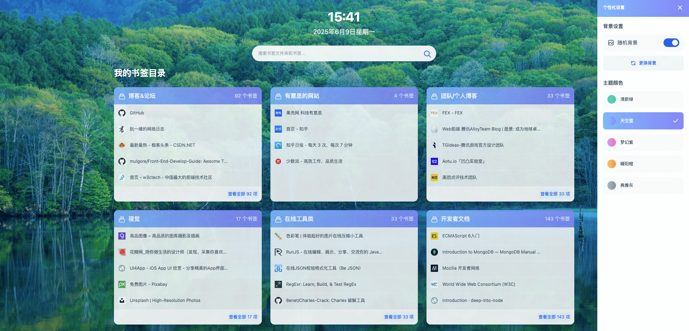
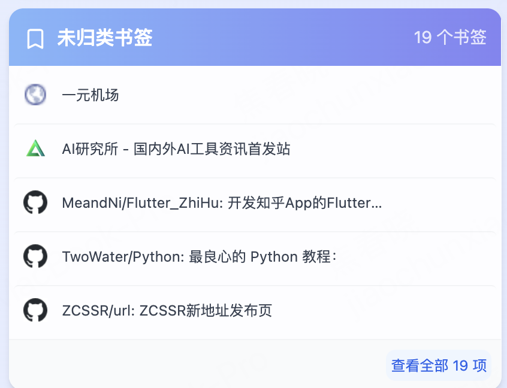
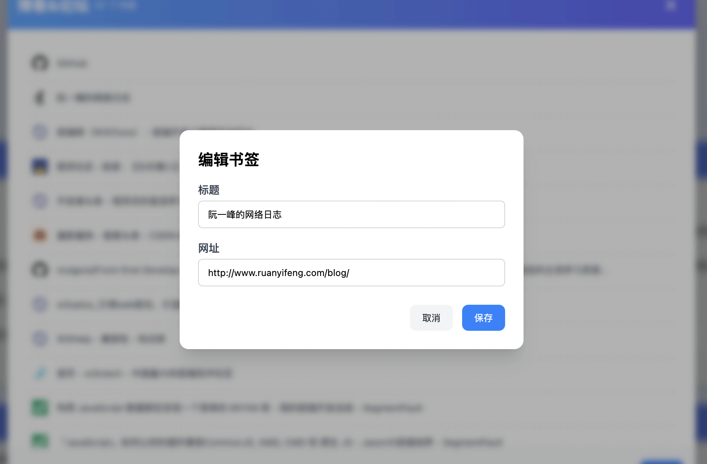

# 📚 Easy Bookmark Manager

<div align="center">


A modern Chrome extension that provides an elegant bookmark management experience

[Features](#-features) • [Tech Stack](#-tech-stack) • [Installation](#-installation--usage) • [Development](#-development-guide) • English  • [中文](./README-zh_CN.md)

</div>

---

## 🌟 Features

### 📁 Smart Folder Management
- **📋 Folder Preview**: Display first 5 bookmarks preview for each folder
- **🔍 Detail View**: Click "View All" to see all bookmarks in folder details
- **✏️ Edit Operations**: Support editing and deleting bookmarks within folders



### ⭐ Uncategorized Bookmark Management
- **🤖 Smart Detection**: Automatically detect bookmarks not categorized into any folder
- **📂 Virtual Folder**: Display uncategorized bookmarks as a special virtual folder
- **🏷️ Special Identification**: Unique icons and descriptions for easy identification
- **🔧 Full Functionality**: Complete support for viewing, editing, and deleting uncategorized bookmarks



### 🔍 Smart Search
- **📁 Folder Search**: Search by folder names
- **🔖 Bookmark Search**: Search bookmark titles within folders
- **⚡ Real-time Filtering**: Instant results as you type

### 🎨 Theme & Background Customization
- **🌈 Multiple Themes**: Various color themes available
- **🖼️ Random Backgrounds**: Support for random background images
- **🔄 Background Toggle**: Switch between solid themes and random backgrounds

### 📝 Bookmark Operations
- **✏️ Edit Bookmarks**: Modify bookmark titles and URLs
- **🗑️ Delete Bookmarks**: Delete unwanted bookmarks with confirmation
- **💬 Operation Feedback**: Success/error messages for all operations




---

## 🛠️ Tech Stack

### Frontend Framework
- **⚛️ React 18**: Modern UI library
- **📘 TypeScript**: Type-safe JavaScript superset
- **🎣 React Hooks**: Modern React development patterns

### Styling & UI
- **🎨 TailwindCSS**: Utility-first CSS framework
- **📱 Responsive Design**: Adaptive design for all screen sizes
- **✨ Animations**: Smooth interaction animations

### Extension Development
- **🔌 Plasmo Framework**: Modern browser extension development framework
- **🌐 Chrome Extension API**: Native Chrome extension API integration
- **📦 Manifest V3**: Latest extension manifest version

### Development Tools
- **📦 Pnpm**: Package manager
- **🔧 PostCSS**: CSS post-processor
- **🎯 ESLint**: Code quality linting

---

## 🚀 Installation & Usage

### Development Setup

1. **Clone Repository**
   ```bash
   git clone https://github.com/jiaochunxiao/easy-bookmark.git
   cd easy-bookmark
   ```

2. **Install Dependencies**
   ```bash
   pnpm install
   ```

3. **Start Development Server**
   ```bash
   pnpm dev
   ```

4. **Load Extension**
   - Open Chrome and go to `chrome://extensions/`
   - Enable "Developer mode"
   - Click "Load unpacked"
   - Select the `build/chrome-mv3-dev` folder from the project

### Production Build

```bash
pnpm build
```

Find the production build in the `build/chrome-mv3-prod` folder

---

## 📖 Development Guide

### Project Structure

```
├── components/                 # React Components
│   ├── FolderCard.tsx         # Folder card component
│   ├── FolderDetailModal.tsx  # Folder detail modal
│   ├── EditBookmarkModal.tsx  # Edit bookmark modal
│   ├── DeleteConfirmModal.tsx # Delete confirmation modal
│   ├── ActionMessage.tsx      # Action message component
│   ├── BookmarkItem.tsx       # Bookmark item component
│   └── ThemeSelector.tsx      # Theme selector
├── hooks/                     # Custom Hooks
│   ├── useBookmarks.ts        # Bookmark data management
│   └── useBackground.ts       # Background management
├── utils/                     # Utility Functions
│   └── index.ts              # Common utilities
├── config/                    # Configuration
│   └── themes.ts             # Theme configuration
├── types/                     # Type Definitions
│   └── index.ts              # TypeScript types
├── newtab.tsx                # Main page component
├── style.css                 # Global styles
└── manifest.json             # Extension manifest
```

### Core Implementation

#### Uncategorized Bookmark Extraction
```typescript
export const extractUncategorizedBookmarks = (node: BookmarkTreeNode): BookmarkTreeNode[] => {
  const uncategorized: BookmarkTreeNode[] = []
  
  const traverse = (currentNode: BookmarkTreeNode) => {
    if (currentNode.children) {
      currentNode.children.forEach(child => {
        if (child.url) {
          // This is a bookmark, add to uncategorized list
          uncategorized.push({
            ...child,
            parentId: currentNode.id
          })
        } else if (child.children) {
          // This is a folder, traverse recursively
          traverse(child)
        }
      })
    }
  }
  
  traverse(node)
  return uncategorized
}
```

#### Virtual Folder Creation
```typescript
export const UNCATEGORIZED_FOLDER_ID = 'uncategorized-bookmarks'

const createUncategorizedFolder = (uncategorizedBookmarks: BookmarkTreeNode[]): BookmarkTreeNode => ({
  id: UNCATEGORIZED_FOLDER_ID,
  title: 'Uncategorized Bookmarks',
  children: uncategorizedBookmarks,
  parentId: 'virtual',
  dateAdded: Date.now(),
  dateGroupModified: Date.now()
})
```

### Development Commands

```bash
# Development mode
pnpm dev

# Production build
pnpm build

pnpm package
```

---

## 🎯 Usage Instructions

### Viewing Bookmarks
1. After installation, open a new tab
2. All bookmark folders will be displayed as cards
3. Uncategorized bookmarks appear as a special virtual folder

### Managing Bookmarks
1. **View Details**: Click the "View All" button on folders
2. **Edit Bookmark**: Click the edit button in the details page
3. **Delete Bookmark**: Click the delete button and confirm

### Search Functionality
1. Enter keywords in the search box
2. System searches both folder names and bookmark titles
3. Real-time display of matching results

### Theme Customization
1. Click the settings button in the top right
2. Choose your preferred color theme
3. Optionally enable random background feature

---

## 🤝 Contributing

We welcome all forms of contributions!

1. Fork the project
2. Create a feature branch
3. Commit your changes
4. Push to the branch
5. Create a Pull Request

---

## 📄 License

This project is licensed under the MIT License

---

## 📞 Contact

For questions or suggestions, please contact us:

- 📧 Email: jiaochunxiao2008@163.com
- 🐛 Issues: [GitHub Issues](https://github.com/jiaochunxiao/easy-bookmark/issues)
- 💬 Discussions: [GitHub Discussions](https://github.com/jiaochunxiao/easy-bookmark/discussions)

---

<div align="center">

**⭐ If this project helps you, please give us a star! ⭐**

Made with ❤️ by jiaochunxiao

</div>